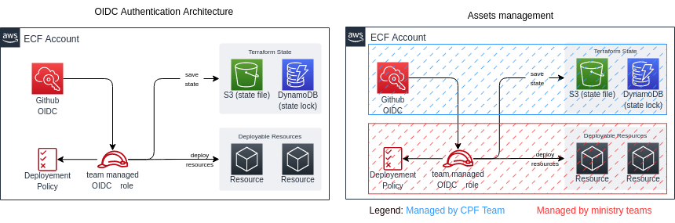

# Overview
Welcome!

In these documentation you will explore the authentication process to access AWS Cloud through Github action witch Github OIDC.  
Also we will show how to use this with terraform.

This integration will allow you to create easy automated pipeline.   To do so we will see how to setup the Github repository and the AWS IAM role to provide access to Github action. 

## Who is this for?

This is for every members of a team using AWS and Github. This document aims to give a general overview so it's designed toward an audience not familiar with devops or microservice experience.  
Please refer to the README linked at the end of this document for more technical documentation.