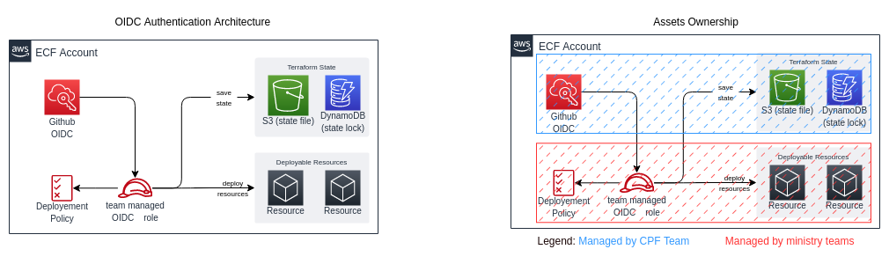

# How does it work ?

## Github OIDC 
OpenID Connect (OIDC) allows GitHub Actions workflows to access resources in Amazon Web Services (AWS), without needing to store the AWS credentials as long-lived GitHub secrets.

## Architecture


```
A project-set is a collections of AWS Account provided by the CPF Team to the Ministry teams.
They are named with a static Licence-plate followed by the environment (for example dev,test and prod).
```

1. In each project-set **the cloud path finder team has created** the web identity GitHub OIDC.  
 **The ministry teams has to create** an AWS IAM Role.  
 And this roles has to be configured with a trust relationship based on the AWS GitHub OIDC provider and link it to your GitHub repository.   
 It needs to be done for each of your github repository and for each of your AWS Account [see exemple](https://github.com/bcgov/startup-sample-project-aws-containers#prerequisites-for-building-in-the-aws-cloud)

2. Every time the job runs, GitHub's OIDC Provider auto-generates an OIDC token. This token contains multiple claims to establish a security-hardened and verifiable identity about the specific workflow that is trying to authenticate. The right needs to be added to the GitHub action [see exemple, focus on permission section](https://github.com/bcgov/startup-sample-project-aws-containers/blob/main/.github/workflows/pr.yaml#:~:text=permissions%3A,for%20actions/checkout)

3. Include a step or action in the job to request this token from GitHub's OIDC provider, and present it to the cloud provider. [see exemple, focus on AWS Credentials step](https://github.com/bcgov/startup-sample-project-aws-containers/blob/main/.github/workflows/pr.yaml#:~:text=%2D%20name%3A%20Configure,%3A%20ca%2Dcentral%2D1)

4. Once the cloud provider successfully validates the claims presented in the token, it then provides a short-lived cloud access token that is available only for the duration of the job.

```
The creation of the IAM AWS Roles, the policy and the Github workflow have to be created by the ministry teams
```