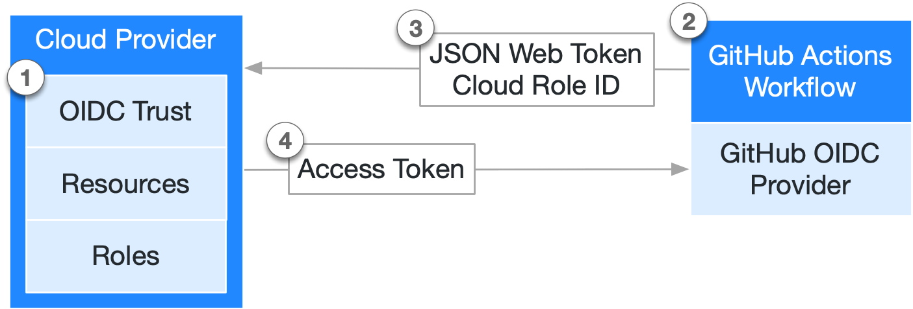

# How does it work ?

## Github OIDC 
OpenID Connect (OIDC) allows your GitHub Actions workflows to access resources in Amazon Web Services (AWS), without needing to store the AWS credentials as long-lived GitHub secrets.

## Architecture

1. In each project-set we have created the web identity GitHub OIDC and you have to create (for each of your github repository and AWS Account) an AWS IAM Role with a trust relationship based on the AWS GitHub OIDC trust and linked to your GitHub repository. [see exemple](https://github.com/bcgov/startup-sample-project-aws-containers#prerequisites-for-building-in-the-aws-cloud)

2. Every time your job runs, GitHub's OIDC Provider auto-generates an OIDC token. This token contains multiple claims to establish a security-hardened and verifiable identity about the specific workflow that is trying to authenticate. You need to add this right to the GitHub action [see exemple](https://github.com/bcgov/startup-sample-project-aws-containers/blob/main/.github/workflows/pr.yaml#:~:text=permissions%3A,for%20actions/checkout)

3. You include a step or action in your job to request this token from GitHub's OIDC provider, and present it to the cloud provider. [see exemple](https://github.com/bcgov/startup-sample-project-aws-containers/blob/main/.github/workflows/pr.yaml#:~:text=%2D%20name%3A%20Configure,%3A%20ca%2Dcentral%2D1)

4. Once the cloud provider successfully validates the claims presented in the token, it then provides a short-lived cloud access token that is available only for the duration of the job.