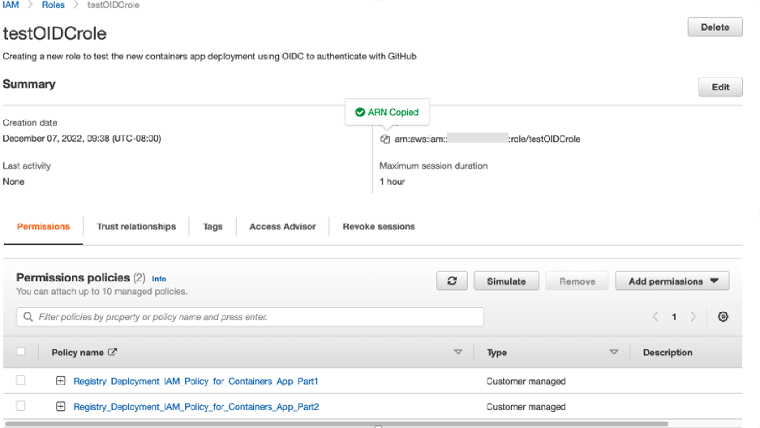
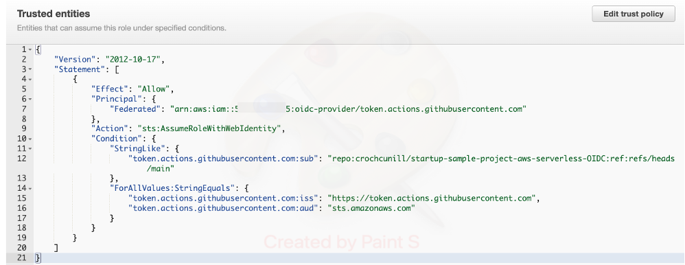
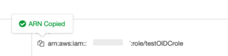

# 2. Configuring AWS to use OIDC

- The AWS environment created for the ministry teams already includes the OIDC components, however, it is necessary to create roles and policies that, using OIDC authentication, will allow trusted third parties (GitHub in this tutorial) to use AWS resources. This trust relationship between GitHub and the AWS account needs to be created for each AWS account that GitHub will use to deploy resources

- The process starts crafting policies. These policies will later be assigned to the role that will be used by the trusted third party (GitHub in this How To). These policies should provide only enough permissions for the third party to do its job, otherwise you may be introducing a security risk. Please check section 4 for suggestions on how to create policies

## 2.1 Crafting policies

- Policies grant specific rights to specific resources.You will need to create policies tailored to the needs ofthe application you are deploying in AWS.

- To create custom policies:
  - a. Log into AWS console
  
    b. Open IAM > Policies

    c. Click on Create policy button

    d. The Wizard will help you to create the policy. Choose a meaningful name for the policy.

- If later you need to change the policy, you can always open it and edit it.

- For example, the code that deploys the application may need to create a S3 bucket, so the policy will Allow the `"s3:CreateBucket"` action. In this context, the code may check if the bucket exists before creating it by listing the existing buckets. So, the code requires to be allowed to execute the `"s3:ListBucket"` action. If the code also requires to delete the bucket after using it, then it the policy needs to allow the `"s3:DeleteBuckets"` action

    So, the resulting policy will be:

```json
{
    "Version": "2012-10-17",
    "Statement": [
        {
            "Sid": "S3",
            "Effect": "Allow",
            "Action": [
                "s3:CreateBucket",
                "s3:ListBucket",
                "s3:DeleteBucket",
                ],
            "Resource": [*]
        }
        ]
}
```

- In the above example these actions allow deletion of any bucket from the code invoked by GitHub Actions.As written above, this policy includes all buckets in the account. For example,it would include buckets created by the budgets service that has nothing to do with your current application. Overall, the code should have the minimum necessary permissions.

- We can restrict the resources to which the policy allows the deletion of buckets. In this case, if we know the app creates a bucket with name `upload-bucket*` a better suited policy can be created, like

```json
{
    "Version": "2012-10-17",
    "Statement": [
        {
            "Sid": "S3",
            "Effect": "Allow",
            "Action": [
                "s3:CreateBucket",
                "s3:ListBucket",
                "s3:DeleteBucket",
                ],
            "Resource": [
                "arn:aws:s3:::upload-bucket*"
            ]
        }
        ]
}
```

- Policies are customized to the app you are deploying in AWS. You will need to craft different policies for different apps.

- Please keep in mind that best practices recommend these policies should only grant the minimum set of permissions necessary for the app to be deployed. See section 4 for suggestions.

## 2.2 Creating a Roles

- Policies are attached to roles. The actions granted by the policies are bestowed on the entities for which the role has a trust relationship

- The steps to create a role are:

    a. Log to the AWS console using your AWS account credentials (for an example see section 5).

    b. In the search tab, type IAM, once found, open the IAM dashboard

    c. On the left side, click on Roles

    d. Click on the Create Rolebutton

    e. Select Web Identityas trusted entity type

    f. Select token.actions.githubusercontent.comas identity providerfrom the drop down

    g. As Audience enter `repo:<repo address>:ref:refs/heads/<branch>` then click Next

    h. Select the policies you want to add to this roleand click Next(the policies created in section 2.1will be listed here)

  - In the following screenshot the policies `Registry_Deployment_IAM_Policy_for_Con-tainers_App_Part1` and `Registry_Deployment_IAM_Policy_for_Containers_App_Part2` have been added to the list of policies for the role

    

    i. Give the role a name (in this example we will use the name testOIDCrole), write a description of it, review the information.
    - Note: In the above page you will find the Select trusted entities section with an Edit button that sug-gests that is possible to edit the trusted entities from this page. When going through this procedure, the Edit button simply returned to the previous step in the role creation procedure. In this context, the instructions in this How to suggest proceeding and later edit the trusted entities (step k)

    j. Go to the end of the page and click on the Create Role button.

    k. Once created, search and open the role . You can add, remove permissions, and edit the trusted entities by opening the Trust relationships tab and clicking on the Edit trust policy
    

    tweak it to be like below

```json
{
    "Version": "2012-10-17",
    "Statement": [
        {
            "Effect": "Allow",
            "Action": "sts:AssumeRoleWithWebIdentity",
            "Principal": {
                "Federated": "arn:aws:iam::512345678905:oidc-provider/token.actions.githubusercontent.com"
            },
            "Condition": {
                "StringLike": {
                    "token.actions.githubusercontent.com:sub": [
                        "repo:myreporoot/myreponame:*"
                    ]
                },
            "ForAllValues:StringEquals": {
                    "token.actions.githubusercontent.com:aud": "sts.amazonaws.com",
                    "token.actions.githubusercontent.com:iss": "https://token.actions.githubusercontent.com"
                }
            }
        }
    ]
}

```

- The number in the Federated key is the AWS account number that you are using. The value for the Condition key corresponds to the repo and branch (see point g) used by GitHub actions to deploy the app

  - Note: The step creates a trust relationship between AWS and GitHub and grants the permissions allowed in the policies to run the code in the repository indicated in Condition to GitHub actions. Code included in other repositories will require to be added as another Condition
  - The example covers all branches in the repository

```json
"StringLike": {
                    "token.actions.githubusercontent.com:sub": [
                        "repo:myreporoot/myreponame:*"
                    ]
                }
```

- So all branches in the repo can assume the role and deploy the app.

l. Once the Trust relationships have been edited, click the Update policy button to save the edits

m. Find and save the arn for the newly created role. In the previous example, from the above screenshot



would be:
arn:aws:iam::512345678906:role/testOIDCrole

- The arn value will be used later when configuring GitHub to use OIDC

  - Note: Notice the role ties together the polices (listed in the Permissions tab) with the trust relationship. In the example above, GitHub can only assume the role that will allow to deploy the app when it connects to AWS through a web call and from a specific repo

## Note

- When using GitHub OIDC to deploy the applications to AWS via Infrastructure as a code(example Terraform), you need an S3 Bucket and DynamoDB table created. The S3 Bucket is to store the state files and the DynamoDB table is used to store the lock files.

- More on using s3 backend with terraform can be found [here](https://developer.hashicorp.com/terraform/language/settings/backends/s3)

- You can use AWS CLI to create the s3 bucket and DynamoDB table.
  - you need AWS CLI already installed to manage and interact with various services provided by the AWS.

  - Please refer to the documentation [here](https://docs.aws.amazon.com/cli/latest/userguide/getting-started-install.html) to install the AWS CLI for your operating system. We also recommend using package managers like [Homebrew](https://brew.sh/) for mac or [Chocolatey](https://chocolatey.org/) for windows to download and manage all the tools and softwares, which makes it easy to install, uninstall or upggrade the softwares.

    - After the AWS CLI is installed, you can use the following commands to create S3 and DynamoDB tables.

    - To create an s3 bucket with the name `terraform-remote-state-167465127160` you can use the following command

    ```bash
        aws s3api create-bucket --bucket terraform-remote-state-167465127160 --region ca-central-1 --create-bucket-configuration LocationConstraint=ca-central-1
    ```

    - To enable bucket versioning on the created s3 bucket `terraform-remote-state-167465127160` you can use the following command

    ```bash
        aws s3api put-bucket-versioning --bucket terraform-remote-state-167465127160 --versioning-configuration Status=Enabled
    ```

    `Note that the S3 bucket names should be globally unique. So please change the bucket name highlighted to a unique name. In the above bucket example we used the bucket name followed by a AWS AccountID which is unique to each AWS account.`

    - To create a DynamoDB table with the name `Terraform-backend-lock-167465127160` to store the lock files you can use the following command

    ```bash
    aws dynamodb create-table --table-name Terraform-backend-lock-167465127160 --attribute-definitions AttributeName=LockID,AttributeType=S --key-schema AttributeName=LockID,KeyType=HASH --provisioned-throughput ReadCapacityUnits=5,WriteCapacityUnits=5
    ```
