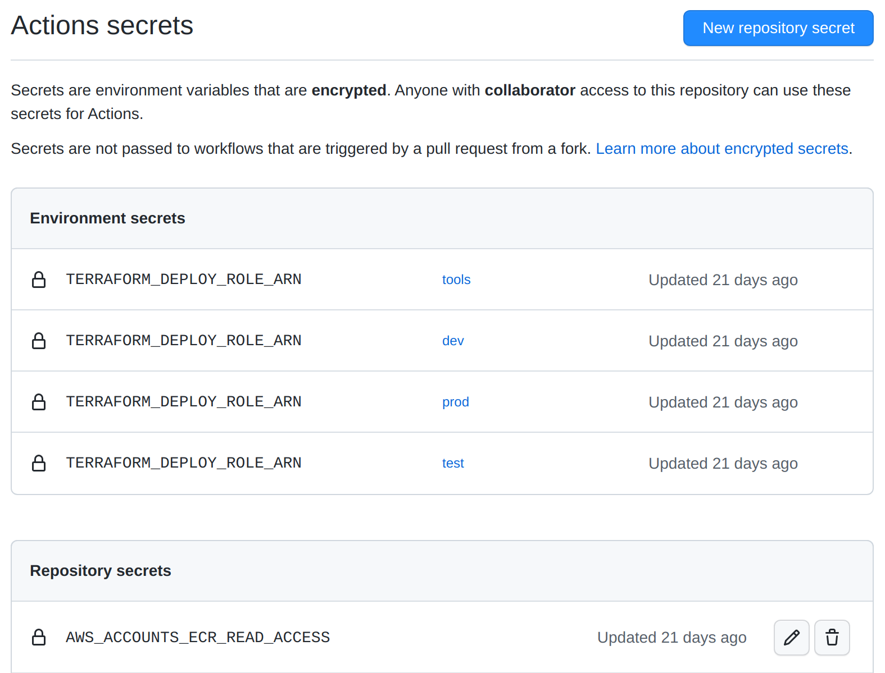

# Github configuration

## Context
Following every step on the way we have now multiple AWS account (dev,test and prod) on which we have created IAM Role.  
Those roles have a trust relationship policy stating that the Github repository from which we want to deploy our application / Infrastructure / Docker (etc...) have the right to assume them.

We now need to set-up our Github repository and workflow to use them and deploy!


## Set up of the Github environment

Now that we can use the AWS Iam role in our Github actions to access the AWS account we need to set up the workflow to do so.
For that we are gonna have to provide to the Github workflow the unique AWS identifier of the IAM role to assume (ARN).

We can use the GitHub environment to set in each of them (dev,test and prod) the right AWS IAM Role ARN in a secret environment variable (see documentation)[https://docs.github.com/en/actions/deployment/targeting-different-environments/using-environments-for-deployment]

```
jobs:
  deploying_dev:
    name: Deploy dev 
    environment: dev
    runs-on: ubuntu-22.04
```

The simple fact of declaring the key: `environment` in the workflow actions file will create it in Github and will be showed in the landing page of your repository after the first workflow execution like so:


In this example the Github action jobs is declared to be in the dev environment, so this will have access to the general repository secrets but also to the dev Github environment secrets.  
The IAM AWS Role ARN kept on the side in the previous step can now be uploaded as an environment secret

