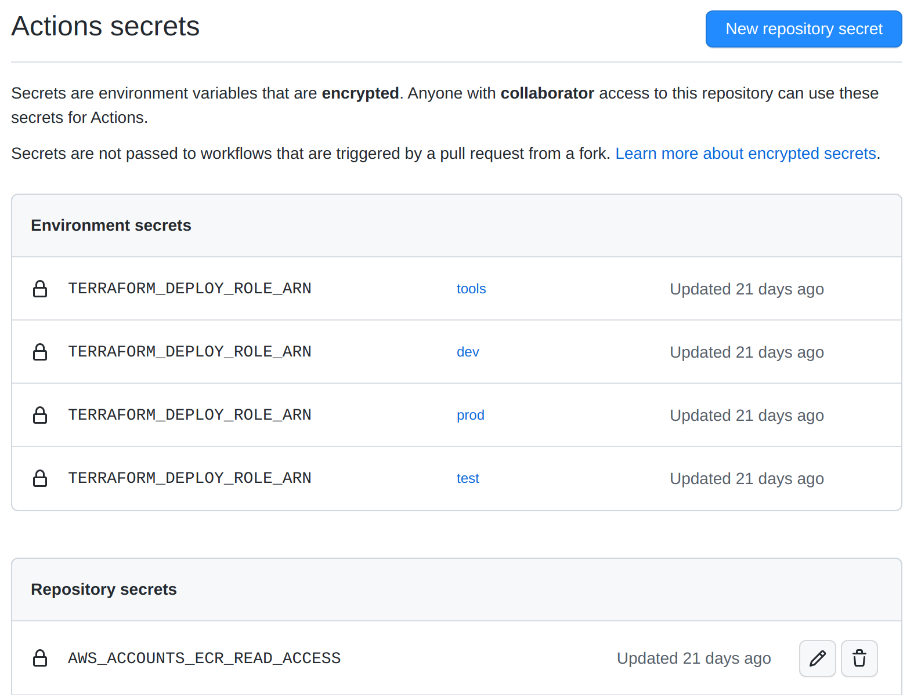

# Github configuration

## Context
The creation of AWS IAM roles ARN necesary in this page has been covered in previous steps  

These AWS IAM roles must have been configured to trust the Github repository from which the application / Infrastructure / Docker (etc...) it's deployed.

In this page we will see how to configure the Github actions to assume the created IAM Roles.


## Set up of the Github environment

In the context of having AWS account for each *dev,test and prod*, the Github actions need to target the right environment and, by extension the right AWS account.  

For that the [Github environment](https://docs.github.com/en/actions/deployment/targeting-different-environments/using-environments-for-deployment) can be used to simplify the Github actions configuration.

To create the different Github environment needed, please follow [this documentation](https://docs.github.com/en/actions/deployment/targeting-different-environments/using-environments-for-deployment#creating-an-environment).   

The GitHub environment are use to set, in each of *dev,test and prod*, the *previously stored* AWS IAM Role ARN as a secret environment variable [see documentation](https://docs.github.com/en/actions/deployment/targeting-different-environments/using-environments-for-deployment#environment-secrets)


In the configuration file of the github action the right environment is selected using the key `environment`:

```
jobs:
  deploying_dev:
    name: Deploy dev 
    environment: dev
    runs-on: ubuntu-22.04
```

Once an environment has been set in a github action jobs, the steps of this job will only be able to access the general secrets and the secrets of the selected environment. 

In this example the Github action jobs is declared to be in the dev environment, so it will have access to the general repository secrets but also to the dev Github environment secrets.  

Because of this behaviour, the jobs will read the secret   
`TERRAFORM_DEPLOY_ROLE_ARN` of the `dev` *Github enviroment* and will be able to deploy on the subsequent AWS account. 