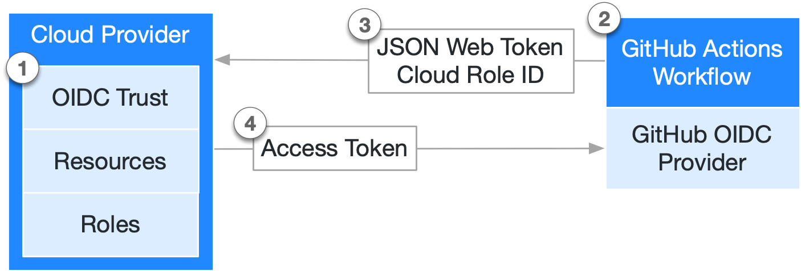

# Overview
Welcome!

In these documentation we will explore the authentication process to access AWS (Amazon web services) Cloud through Github action witch Github OIDC (OpenID Connect).  

Also we will present how to use this authentication with terraform as it removes the need of using Terraform cloud.

This integration will allow to create easy automated pipeline.  
To do so we will see how to setup the Github repository and the AWS IAM role to provide access to Github action. 

## Who is this for?

This is for every members of a team using AWS and Github. This document aims to give a general overview so it's designed toward an audience not familiar with devops or microservice experience.  
Please refer to the README linked at the end of this document for more technical documentation.